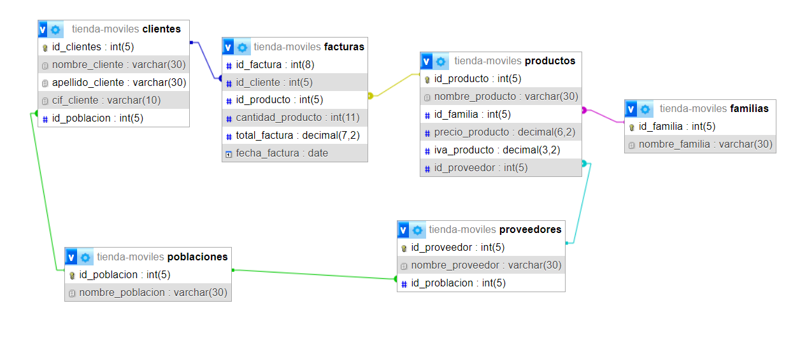

# SQL p. II
## Tutoriales 
### Tutorial MariaDB
_Para aprender a ejecutar MariaDB, [ves a la seccion Ejecución MariaDB](#ejecución-mariadb)_

- En MariaDB ponemos `show databases;` y nos muestra las bases de datos.
- `create database escuela;` para crear una nueva base de datos llamada escuela.
- `use escuela` para entrar dentro de la tabla.
- Para crear una nueva tabla:
```sql
create table `alumnos` (`id_alumno` INT(2) NOT NULL AUTO_INCREMENT, `nombre` VARCHAR(20), PRIMARY KEY(id_alumno) );
```
- `INSERT INTO alumnos (nombre) VALUES ('Maria');` insertamos un alumno llamado Maria
- `INSERT INTO alumnos (nombre) VALUES ('Marta'), ('Pepe'), ('Juan');` insertamos un grupo de alumnos(varios values)
- `DELETE FROM alumnos WHERE id_alumno = 3;` eliminamos el alumno con el id 3
- `show tables;` mostramos las tablas
- `DELETE FROM alumnos WHERE nombre = 'Marta';` eliminamos los alumnos con ese nombre
- `SELECT nombre FROM alumnos WHERE nombre LIKE 'J%';` seleccionamos los alumnos que empiezan con J
- `SELECT nombre FROM alumnos WHERE nombre LIKE '_a%';` seleccionamos los alumnos que tengas `a` como segunda letra
- `UPDATE alumnos SET nombre = "Bill" WHERE id_alumno = 7;` modificamos el alumno 7 por Bill.
- `INSERT INTO alumnos (id_alumno, nombre) VALUES (3, "Sofia");` introducimos varios datos a la vez.
- `SELECT nombre, fecha FROM productos ORDER BY fecha DESC, nombre ASC;` nos muestra todos los productos ordenador por fecha, de forma descendente, cuando haya empate, que los ordene por nombre y ascendente.
- `SELECT nombre, fecha FROM productos ORDER BY fecha DESC, nombre ASC LIMIT 2;` lo mismo que lo anterior pero limitandolo a los dos primeros resualtados.
- Con el siguiente query creamos una tabla relacional:
    ```sql
    CREATE TABLE `tienda-test`.`facturas` (
        `id_factura` INT NOT NULL AUTO_INCREMENT,
        `id_cliente` INT NOT NULL,
        `id_producto` INT NOT NULL,
        `unidades` INT NOT NULL,
        `total` INT NOT NULL,
        `IVA` INT NOT NULL,
        `fecha_venta` DATE NOT NULL DEFAULT CURRENT_TIMESTAMP,
        PRIMARY KEY (`id_factura`),
        FOREIGN KEY (`id_producto`) REFERENCES `productos`(`id_producto`),
        FOREIGN KEY (`id_cliente`) REFERENCES `clientes`(`id_cliente`)
    ) ENGINE = InnoDB;
    ```
- Con el siguiente query relacionamos los id entre las tablas:
  ```sql
  -- Añadir la columna precio\producto a la tabla de facturas 
      ALTER TABLE `facturas` ADD `precio_producto` INT NOT NULL AFTER `fecha_venta`; 
  -- Actualizar el precio\producto con el precio del producto correspondiente 
      UPDATE `facturas` AS f 
      INNER JOIN `productos` AS p ON f.`id_producto` = p.`id_producto` SET f.`precio_producto` = p.`precio`;
  ```
_Primero agregamos la columna `precio_producto` a la tabla de facturas. Luego, utilizamos una consulta `UPDATE` para asignar el precio del producto correspondiente al `id_producto` en la tabla de productos a la columna `precio_producto` en la tabla de facturas. Utilizamos un `INNER JOIN` para combinar las filas de ambas tablas en función del `id_producto`._

- #### Ejemplo grafico de tablas relacionadas entre si:


- #### ["Export/querys" de dichas tablas](sql1.sql)

- Query para consultar el nombre de: la gente que haya comprado, que sea de Barcelona y limitado a 25 respuestas:
```sql
SELECT CONCAT(cl.nombre_cliente, ' ', cl.apellido_cliente) as nombre_completo
FROM clientes cl, poblaciones po
WHERE cl.id_poblacion = po.id_poblacion
and po.nombre_poblacion = "Barcelona"
LIMIT 0, 25;
```
### Tutorial MySQL
 [Ejecutar este archivo en MySQL.](sql2.sql)
 _Para aprender a ejecutar MySQL, cargar archivos o utilizarlos, ve a la seccion [MySQL del archivo SQL.md](sql.md/#mysql)_
