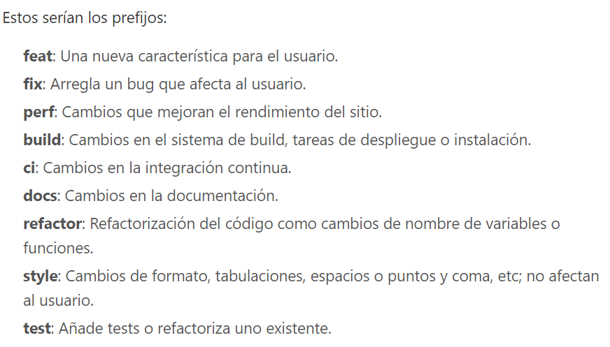
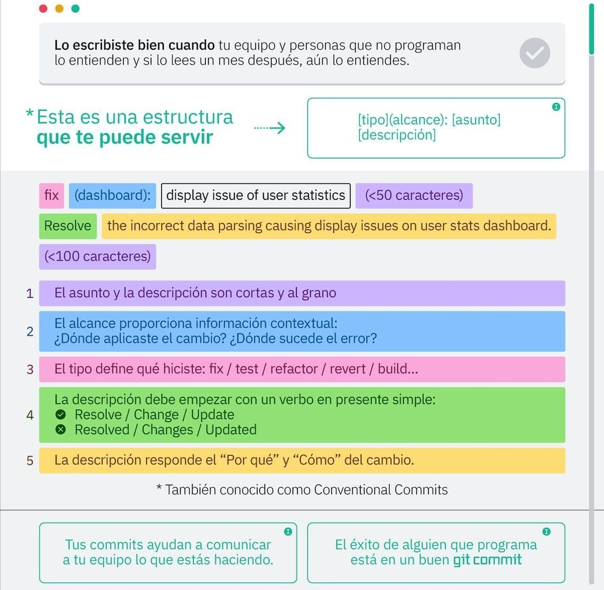

# Git tips
## Estandar commits

- Estructura general:


## Repositorio temporal
Clonar a un repositorio temporal para luego extraer en la carpeta raiz e eliminar la carpeta original(copiada de github con el seguimiento)

_Sirve para copiar repos sin permiso del autor y dejar de seguir_ Para ejecutar correctamente se debe lanzar los codigos en **la carpeta donde se va a crear el proyecto**
- 1 Clona el repositorio en una carpeta temporal.
- 2 Mueve los archivos del repositorio clonado a la ubicación deseada.
- 3 Elimina la carpeta temporal.

```bash
git clone URL_del_repositorio tmp_repo
mv tmp_repo/* .
rm -rf tmp_repo
```

## Git pull especial
Comando para cuando tenemos un repositorio que no tiene un seguimiento y lo queremos subir a continuacion de un repositiorio ya existente
**Ojo, hay que tener commit los archivos**

_Después de ejecutar este comando, Git intentará fusionar las historias de las dos ramas. Sin embargo, ten en cuenta que es posible que tengas que resolver conflictos si existen diferencias significativas entre las ramas._
```bash
git pull origin main --allow-unrelated-histories
```

## Git restore losed Github remote

```bash
git remote add origin nombre_de_tu_repositorio
```

## Git push NEW "rama"
**Hacer el add y commit, despues:**
```bash
git checkout -b nombre_de_tu_rama
git push origin nombre_de_tu_rama
```

## Unfollow a Github
Dejar de seguir al repositorio actual en la nube
```bash
git remote -v
git remote remove nombre_de_tu_repo(origin ...)
```

## Git pull
Traer los cambios del remoto (repositorio nube Github) al local (maquina)

- Abre tu terminal o línea de comandos.
- Navega hasta el directorio de tu repositorio local utilizando el comando `cd`.
- Asegúrate de que estás en la rama correcta utilizando el comando `git branch`. Si no estás en la rama correcta, cambia a la rama adecuada usando `git checkout <nombre_de_rama>`.
- Una vez estés en la rama correcta, utiliza el comando `git pull` para traer los cambios del repositorio remoto a tu repositorio local.

## Eliminar git
### Borrando todo el interior de la carpeta
- Abre la terminal o el símbolo del sistema en tu sistema operativo.
- Navega al directorio que contiene el repositorio local que deseas dejar de seguir.
- Utiliza el comando `rm -rf <nombre_del_repositorio>` para eliminar el directorio del repositorio local y todos sus contenidos.

### Borrando solo el git
_Eliminando el archivo . git_

- Navega al directorio raíz del repositorio local que deseas dejar de seguir.
- Utiliza el comando `rm -rf .git` para eliminar el directorio `.git` y todos sus contenidos.

## Git branch merge
Traerte los cambios de una branch a otra rama _("principal")_.
Para traer los cambios de una rama a otra en Git usando Bash, puedes seguir estos pasos:

### Opción 1: Usando `merge`

1. **Cambia a la rama de destino**:

    ```bash
    git checkout nombre-de-la-rama-destino
    ```

2. **Haz el merge** con la rama de origen:

    ```bash
    git merge nombre-de-la-rama-origen
    ```

3. **Envía los cambios al repositorio remoto**:

    ```bash
    git push origin nombre-de-la-rama-destino
    ```

### Opción 2: Usando `rebase`

1. **Cambia a la rama de destino**:

    ```bash
    git checkout nombre-de-la-rama-destino
    ```

2. **Rebase con la rama de origen**:

    ```bash
    git rebase nombre-de-la-rama-origen
    ```

3. **Envía los cambios al repositorio remoto**:

    ```bash
    git push origin nombre-de-la-rama-destino
    ```

### Ejemplo práctico

Supongamos que tienes dos ramas, `main` y `feature-branch`, y quieres traer los cambios de `feature-branch` a `main`.

#### Usando `merge`:

1. Cambia a la rama `main`:

    ```bash
    git checkout main
    ```

2. Haz el merge con `feature-branch`:

    ```bash
    git merge feature-branch
    ```

3. Envía los cambios al repositorio remoto:

    ```bash
    git push origin main
    ```

#### Usando `rebase`:

1. Cambia a la rama `main`:

    ```bash
    git checkout main
    ```

2. Rebase con `feature-branch`:

    ```bash
    git rebase feature-branch
    ```

3. Envía los cambios al repositorio remoto:

    ```bash
    git push origin main
    ```

Recuerda que, en el caso de `rebase`, si el rebase crea conflictos, necesitarás resolverlos y continuar el rebase con:

```bash
git rebase --continue
```

Y luego hacer el `push` de los cambios.
## Eliminar rama en Github(remoto)
Para eliminar una rama existente en tu repositorio de GitHub (remoto), puedes usar el siguiente comando desde Bash:

1. **Elimina la rama remota**:

    ```bash
    git push origin --delete nombre-de-la-rama
    ```

### Ejemplo práctico

Supongamos que deseas eliminar la rama llamada `feature-branch` del repositorio remoto en GitHub:

```bash
git push origin --delete feature-branch
```

### [Pasos adicionales (opcional)](#eliminar-rama-en-gitlocal)
## Eliminar rama en Git(local)

Para eliminar la rama localmente (en tu máquina), puedes usar:

1. **Cambia a otra rama** (para no estar en la rama que deseas eliminar):

    ```bash
    git checkout main
    ```

2. **Elimina la rama local**:

    ```bash
    git branch -d nombre-de-la-rama
    ```

    Si la rama tiene cambios que no se han fusionado, puedes usar `-D` (mayúscula) para forzar la eliminación:

    ```bash
    git branch -D nombre-de-la-rama
    ```

### Ejemplo práctico

Para eliminar `feature-branch` localmente:

1. Cambia a otra rama:

    ```bash
    git checkout main
    ```

2. Elimina la rama localmente:

    ```bash
    git branch -d feature-branch
    ```

    O forzar la eliminación si tiene cambios no fusionados:

    ```bash
    git branch -D feature-branch
    ```

De esta manera, habrás eliminado la rama tanto del repositorio remoto en GitHub como localmente en tu máquina.

## Eliminar varias ramas en Git(local)
Claro, aquí tienes la explicación corregida para eliminar todas las ramas locales excepto `v01` y `v01.03`:

### Cómo eliminar todas las ramas locales excepto `v01` y `v01.03`

Para eliminar todas las ramas locales excepto `v01` y `v01.03`, puedes usar un script en Bash que lista todas las ramas y luego elimina las que no coinciden con `v01` y `v01.03`.

#### Comando

```bash
git branch | grep -v "^\* \| v01$ \| v01.03$" | xargs git branch -d
```

#### Explicación del comando

1. **Listar todas las ramas locales**:

    ```bash
    git branch
    ```

    Esto muestra todas las ramas locales. La salida se verá algo así:

    ```plaintext
      main
      v01
      v01.01
      v01.01.01
      v01.02
      v01.02.00
      v01.02.1
      v01.02.2
      v01.02.3
    * v01.03
    ```

2. **Filtrar las ramas para excluir `v01` y `v01.03`**:

    ```bash
    grep -v "^\* \| v01$ \| v01.03$"
    ```

    Este filtro excluye:
    - La rama actual (indicada por `*`).
    - La rama `v01`.
    - La rama `v01.03`.

3. **Eliminar las ramas filtradas**:

    ```bash
    xargs git branch -d
    ```

    Este comando toma la salida del filtro anterior y pasa cada nombre de rama al comando `git branch -d` para eliminarla.

#### Paso a paso detallado

1. **Listar todas las ramas**:

    Ejecuta el siguiente comando para listar todas las ramas locales:

    ```bash
    git branch
    ```

2. **Filtrar y eliminar las ramas no deseadas**:

    Ejecuta el siguiente comando para filtrar y eliminar todas las ramas excepto `v01` y `v01.03`:

    ```bash
    git branch | grep -v "^\* \| v01$ \| v01.03$" | xargs git branch -d
    ```

    Este comando eliminará todas las ramas locales excepto `v01` y `v01.03`.

#### Nota adicional

- Si algunas de las ramas tienen cambios no fusionados y necesitas forzar la eliminación, puedes usar `-D` en lugar de `-d`:

    ```bash
    git branch | grep -v "^\* \| v01$ \| v01.03$" | xargs git branch -D
    ```

    Ten cuidado con este comando, ya que eliminará las ramas sin preguntar si tienen cambios no fusionados.

Esto asegura que las ramas `v01` y `v01.03` no se eliminen y todas las demás ramas locales sean eliminadas.


## Git fetch
**Actualizar rama de Git con la rama de Github**
Para traer los cambios que han ocurrido en una rama de un repositorio remoto de GitHub a tu repositorio local, puedes seguir estos pasos:

### Paso 1: Configurar el repositorio remoto

Primero, asegúrate de que tu repositorio local esté configurado para rastrear el repositorio remoto de GitHub.

Si no lo has hecho, añade el repositorio remoto:

```bash
git remote add origin https://github.com/tu-usuario/tu-repositorio.git
```

### Paso 2: Actualizar las referencias remotas

Actualiza la información de las ramas remotas:

```bash
git fetch origin
```

### Paso 3: Integrar los cambios

Dependiendo de si quieres integrar los cambios en tu rama actual o en una rama específica, puedes usar `merge` o `rebase`.

#### Opción 1: Usar `merge`

1. **Cambiar a la rama en la que deseas integrar los cambios** (por ejemplo, `main`):

    ```bash
    git checkout main
    ```

2. **Hacer el merge** de los cambios de la rama remota:

    ```bash
    git merge origin/nombre-de-la-rama
    ```

#### Opción 2: Usar `rebase`

1. **Cambiar a la rama en la que deseas integrar los cambios** (por ejemplo, `main`):

    ```bash
    git checkout main
    ```

2. **Hacer el rebase** de los cambios de la rama remota:

    ```bash
    git rebase origin/nombre-de-la-rama
    ```

### Ejemplo práctico

Supongamos que tienes una rama llamada `feature-branch` en tu repositorio remoto en GitHub, y quieres traer esos cambios a tu rama local `main`.

#### Usar `merge`

1. Cambia a la rama `main`:

    ```bash
    git checkout main
    ```

2. Trae los cambios de la rama remota `feature-branch`:

    ```bash
    git fetch origin
    git merge origin/feature-branch
    ```

#### Usar `rebase`

1. Cambia a la rama `main`:

    ```bash
    git checkout main
    ```

2. Trae los cambios de la rama remota `feature-branch`:

    ```bash
    git fetch origin
    git rebase origin/feature-branch
    ```

### Nota

- Si no tienes la rama local correspondiente, puedes crearla directamente desde la rama remota:

    ```bash
    git checkout -b nombre-de-la-rama-local origin/nombre-de-la-rama-remota
    ```

- Después de hacer `merge` o `rebase`, si deseas actualizar el repositorio remoto con tus cambios locales (en caso de que haya nuevos commits), usa:

    ```bash
    git push origin nombre-de-la-rama
    ```

Siguiendo estos pasos, podrás traer los cambios de una rama de tu repositorio de GitHub a tu repositorio local de manera eficiente.

## Git fetch vs git pull
### Diferencias entre `git fetch` y `git pull`

- **`git fetch`**:
  - `git fetch` actualiza tu repositorio local con los cambios más recientes del repositorio remoto. No fusiona esos cambios en tu rama actual; simplemente actualiza las referencias remotas.
  - Esto te permite revisar los cambios antes de integrarlos.

- **`git pull`**:
  - `git pull` es equivalente a ejecutar `git fetch` seguido de `git merge`. Trae los cambios del repositorio remoto y los fusiona directamente en tu rama actual.

### Cuándo usar `git fetch`

Usar `git fetch` seguido de un comando como `git merge` o `git rebase` te da más control sobre cómo y cuándo integras los cambios. Este enfoque es útil cuando deseas revisar los cambios antes de aplicarlos.

### Ejemplo práctico usando `git fetch`

1. **Actualizar las referencias remotas**:

    ```bash
    git fetch origin
    ```

2. **Revisar los cambios (opcional)**:

    Puedes revisar los cambios que se han traído con `fetch` antes de fusionarlos.

    ```bash
    git log origin/nombre-de-la-rama
    ```

3. **Integrar los cambios**:
    - **Usando `merge`**:

        Cambia a la rama en la que deseas integrar los cambios (por ejemplo, `main`):

        ```bash
        git checkout main
        ```

        Haz el merge con la rama remota:

        ```bash
        git merge origin/nombre-de-la-rama
        ```

    - **Usando `rebase`**:

        Cambia a la rama en la que deseas integrar los cambios (por ejemplo, `main`):

        ```bash
        git checkout main
        ```

        Haz el rebase con la rama remota:

        ```bash
        git rebase origin/nombre-de-la-rama
        ```

### Ejemplo práctico usando `git pull`

Si deseas traer y fusionar los cambios en un solo paso, puedes usar `git pull`.

1. **Cambiar a la rama en la que deseas integrar los cambios** (por ejemplo, `main`):

    ```bash
    git checkout main
    ```

2. **Traer y fusionar los cambios de la rama remota**:

    ```bash
    git pull origin nombre-de-la-rama
    ```

### ¿Cuál usar?

- **`git fetch` seguido de `merge` o `rebase`**:
  - Más control sobre la integración de cambios.
  - Puedes revisar los cambios antes de integrarlos.
  - Útil en entornos de desarrollo colaborativos donde deseas evitar conflictos de integración inesperados.

- **`git pull`**:
  - Más rápido y conveniente si confías en los cambios y deseas fusionarlos directamente.
  - Útil para mantener ramas de desarrollo sincronizadas rápidamente.

Ambos métodos son válidos, y la elección depende de tu flujo de trabajo y necesidades específicas.

## Revertir commit en Git (local)
Para revertir un commit en Git y volver el HEAD a un commit anterior, puedes seguir estos pasos:

### 1. Verificar el commit que deseas deshacer
Primero, asegúrate de cuál es el commit al que quieres regresar el HEAD. En este ejemplo vamos a revertir el commit más reciente _
_"anterior al actual"_ `ef1794f`.

### 2. Usar `git reset` para mover el HEAD
Abre tu terminal y navega hasta el directorio de tu repositorio local. Luego, ejecuta el siguiente comando:

```bash
git reset --hard HEAD^
```

Este comando hará lo siguiente:
- `git reset --hard`: Revertirá el HEAD y el índice al commit especificado.
- `HEAD^`: Este es un atajo para referirse al commit anterior al actual.

Después de ejecutar este comando, el commit `ef1794f` y todos los cambios realizados en él serán eliminados del árbol de confirmaciones y el HEAD se moverá al commit anterior (`e61d56b` en tu caso).

### 3. Verificar el estado del repositorio
Puedes usar `git log` para verificar que el HEAD esté ahora en el commit correcto:

```bash
git log --oneline
```

Esto mostrará los últimos commits en una línea cada uno, para que puedas asegurarte de que el HEAD esté donde quieres que esté.

### 4. Ajustar la rama remota (si es necesario)
Si ya has empujado el commit `ef1794f` a la rama remota y necesitas ajustarla también, puedes usar `git push --force` para forzar la actualización de la rama remota:

```bash
git push origin v01.03 --force
```

**Nota de precaución:** Ten cuidado al usar `git push --force` ya que sobrescribirá la historia del repositorio remoto. Esto puede causar problemas si otros colaboradores ya tienen copias del repositorio con el commit que estás eliminando.

### Resumen
- `git reset --hard HEAD^`: Revierte el HEAD al commit anterior y elimina todos los cambios hechos en el commit que quieres deshacer.
- Después de esto, verifica el estado del repositorio local y decide si necesitas ajustar la rama remota.

Siguiendo estos pasos, podrás deshacer el commit no deseado y regresar el HEAD a su estado anterior en tu rama local.

## Git fork 
Realizar un "fork" en Git es una acción común cuando deseas copiar un repositorio existente a tu cuenta personal en una plataforma de alojamiento como GitHub, GitLab o Bitbucket. Esto te permite trabajar en tu propia versión del proyecto sin afectar el repositorio original. Aquí te explico cómo hacerlo:

### Pasos para hacer un "fork":

1. **Accede al repositorio original:**
   Ve al sitio web donde está alojado el repositorio que deseas forkear. Por ejemplo, si es GitHub, navega a la página del repositorio en tu navegador.

2. **Haz clic en el botón "Fork":**
   En la página del repositorio original, busca y haz clic en el botón "Fork" en la esquina superior derecha de la página. Esto iniciará el proceso de copia del repositorio a tu cuenta.

3. **Selecciona la cuenta o la organización:**
   Si tienes varias cuentas u organizaciones bajo las cuales quieres realizar el fork, selecciona la adecuada.

4. **Espera a que se complete el proceso:**
   La plataforma copiará automáticamente el repositorio a tu cuenta. Dependiendo del tamaño del repositorio y la velocidad del servidor, esto puede tomar algunos segundos o minutos.

### Clonar el repositorio forked localmente:

Una vez que hayas hecho el fork, puedes clonar tu repositorio forked localmente en tu máquina usando Git. Aquí está cómo hacerlo:

1. **Obtén la URL del repositorio forked:**
   En la página del repositorio forked en la plataforma (por ejemplo, GitHub), haz clic en el botón verde "Code" y copia la URL proporcionada.

2. **Abre tu terminal:**
   Navega al directorio donde deseas clonar el repositorio y abre tu terminal.

3. **Clona el repositorio:**
   Ejecuta el siguiente comando en tu terminal, reemplazando `<URL>` con la URL que copiaste:

   ```bash
   git clone <URL>
   ```

   Por ejemplo:

   ```bash
   git clone https://github.com/tu-usuario/repo-forked.git
   ```

4. **Accede al repositorio clonado:**
   Una vez que el comando haya completado la descarga, puedes acceder al directorio del repositorio clonado usando `cd repo-forked`.

### Realizar cambios y trabajar en tu repositorio forked:

Ahora que tienes el repositorio forked en tu cuenta y clonado en tu máquina, puedes trabajar en él como lo harías con cualquier otro repositorio Git:

- Crea, modifica y elimina archivos según sea necesario.
- Usa `git add`, `git commit` y `git push` para gestionar tus cambios localmente y luego enviarlos a tu repositorio forked en la plataforma.

### Mantener tu repositorio forked actualizado:

Es posible que desees mantener tu repositorio forked actualizado con respecto al repositorio original del que hiciste el fork. Para hacer esto, puedes agregar el repositorio original como un "remote" en tu repositorio forked y fusionar los cambios cuando sea necesario. Aquí está cómo hacerlo:

1. **Agregar el repositorio original como un remote:**
   
   ```bash
   git remote add upstream <URL-del-repositorio-original>
   ```

   Por ejemplo:

   ```bash
   git remote add upstream https://github.com/usuario-original/repo-original.git
   ```

2. **Actualizar y fusionar los cambios desde el repositorio original:**

   ```bash
   git fetch upstream
   git merge upstream/main  # o la rama principal que esté usando el repositorio original
   ```

   Esto traerá los cambios más recientes del repositorio original a tu repositorio forked local.

Siguiendo estos pasos, podrás hacer un "fork" de un repositorio existente a tu cuenta personal y trabajar en tu propia versión del proyecto.

## Git "fork" con git clone
**Clonar un repositorio del cual no tienes permisos y realizar cambios en un repositorio de tu github**

Para hacer el git clone de un repositorio del cual no tenemos permisos para subir cambios, primero:
- Clonamos, haciendo uso de git clone, el repositorio con el cual queremos trabajar.
- Creamos un repositorio o buscamos su url de acceso remoto, en nuestro Github, Gitlab, etc..


Después de hacer el "fork"(clone) de un repositorio en plataformas como GitHub, GitLab, etc., el remote `origin` por defecto seguirá apuntando al repositorio original del cual hiciste el fork, no a tu cuenta personal automáticamente. Para configurarlo correctamente:

1. **Verifica los remotes actuales:**
   ```bash
   git remote -v
   ```
   Esto muestra los remotes configurados, donde `origin` apunta al repositorio original.

2. **Cambia `origin` a tu repositorio forked:**
   ```bash
   git remote set-url origin https://github.com/tu-usuario/repo-forked.git
   ```
   Reemplaza `https://github.com/tu-usuario/repo-forked.git` con la URL de tu repositorio forked en la plataforma correspondiente.

3. **Verifica el cambio:**
   ```bash
   git remote -v
   ```
   Debe mostrar que `origin` ahora apunta a tu repositorio forked en tu cuenta personal.

Con estos pasos, `origin` estará configurado correctamente para reflejar tu repositorio forked, permitiéndote trabajar y empujar cambios a tu propia versión del proyecto sin afectar el repositorio original.

## Git cherry-pick
Para mover los cambios que has guardado en una rama incorrecta a la rama correspondiente, puedes seguir estos pasos:

1. **Identificar el commit**: Primero, asegúrate de conocer el hash del commit que quieres mover. En tu caso, es `eb1307f`.

2. **Cambiar a la rama correcta**: Ve a la rama donde deberían estar los cambios.

3. **Cherry-pick el commit**: Aplica el commit a la rama correcta usando `git cherry-pick`.

4. **Revertir el commit en la rama incorrecta**: Si deseas eliminar el commit de la rama incorrecta, puedes hacerlo usando `git reset` o `git revert`.

A continuación, los pasos detallados:

### Paso 1: Identificar el commit
Ya tienes el hash del commit `eb1307f`.

### Paso 2: Cambiar a la rama correcta
Supongamos que la rama correcta es `feature/correct-branch`. Cambia a esa rama:

```sh
git checkout feature/correct-branch
```

### Paso 3: Cherry-pick el commit
Aplica el commit específico a la rama correcta:

```sh
git cherry-pick eb1307f
```

### Paso 4: Revertir el commit en la rama incorrecta
Vuelve a la rama donde hiciste el commit original:

```sh
git checkout v01
```

#### Opción 1: Usar `git reset` (si no has compartido la rama con otros)
Si nadie más ha trabajado en esta rama y es seguro cambiar el historial, puedes usar `git reset` para eliminar el commit:

```sh
git reset --hard HEAD~1
```

#### Opción 2: Usar `git revert` (si ya has compartido la rama)
Si ya has compartido esta rama con otros y necesitas mantener el historial, usa `git revert` para deshacer el commit sin cambiar el historial:

```sh
git revert eb1307f
```

Esto creará un nuevo commit que deshace los cambios introducidos por `eb1307f`.
## Configuración usuarios
### Ver configuracion usuario
Para ver la configuración de tu Git como usuario, puedes utilizar el siguiente comando en la línea de comandos (terminal):

```sh
git config --list
```

Este comando muestra todas las configuraciones de Git, tanto globales como locales. Si deseas ver solo la configuración global (la que se aplica a todos tus repositorios), puedes usar:

```sh
git config --global --list
```

Para ver la configuración específica de un repositorio en el que estés trabajando, puedes utilizar:

```sh
git config --local --list
```

Si deseas ver una configuración específica, como tu nombre de usuario o correo electrónico, puedes usar:

```sh
git config user.name
git config user.email
```

Estos comandos te mostrarán el nombre de usuario y el correo electrónico configurados, respectivamente.

### Eliminar configuracion global y poner local
Sí, esa es una buena estrategia. Si deseas trabajar con varios usuarios de GitHub en la misma máquina, puedes eliminar la configuración global del usuario y configurar el usuario correspondiente de manera local en cada repositorio. Aquí tienes los pasos detallados para hacerlo:

1. **Eliminar la configuración global de usuario:**

   Para eliminar la configuración global del usuario, puedes usar los siguientes comandos:

   ```sh
   git config --global --unset user.name
   git config --global --unset user.email
   ```

2. **Configurar el usuario a nivel local en cada repositorio:**

   Luego, puedes configurar el usuario correspondiente para cada proyecto de manera local. Ve al directorio del proyecto y usa los siguientes comandos para establecer el nombre y el correo electrónico:

   ```sh
   cd /ruta/a/tu/proyecto
   git config user.name "Tu Nombre"
   git config user.email "tu_email@example.com"
   ```

3. **Verificar la configuración local:**

   Para asegurarte de que la configuración local se ha aplicado correctamente, puedes listar la configuración local del repositorio:

   ```sh
   git config --local --list
   ```

#### Ejemplo

Supongamos que tienes dos proyectos: `proyectoA` y `proyectoB`. Quieres usar el usuario `usuario1` para `proyectoA` y `usuario2` para `proyectoB`.

Para `proyectoA`:

```sh
cd /ruta/a/proyectoA
git config user.name "Usuario1"
git config user.email "usuario1@example.com"
```

Para `proyectoB`:

```sh
cd /ruta/a/proyectoB
git config user.name "Usuario2"
git config user.email "usuario2@example.com"
```

#### Alternativa: Usar múltiples SSH keys

Otra opción avanzada es configurar múltiples claves SSH para cada cuenta de GitHub y usar el archivo `~/.ssh/config` para manejar estas claves. Aquí tienes un resumen de los pasos:

1. **Generar claves SSH para cada cuenta:**

   ```sh
   ssh-keygen -t rsa -C "tu_email1@example.com" -f ~/.ssh/id_rsa_usuario1
   ssh-keygen -t rsa -C "tu_email2@example.com" -f ~/.ssh/id_rsa_usuario2
   ```

2. **Agregar las claves SSH a tu agente SSH:**

   ```sh
   ssh-add ~/.ssh/id_rsa_usuario1
   ssh-add ~/.ssh/id_rsa_usuario2
   ```

3. **Configurar el archivo `~/.ssh/config`:**

   Abre (o crea) el archivo `~/.ssh/config` y añade la configuración para cada cuenta:

   ```sh
   Host github-usuario1
       HostName github.com
       User git
       IdentityFile ~/.ssh/id_rsa_usuario1

   Host github-usuario2
       HostName github.com
       User git
       IdentityFile ~/.ssh/id_rsa_usuario2
   ```

4. **Configurar el origen remoto en cada repositorio para usar el host adecuado:**

   En `proyectoA`:

   ```sh
   cd /ruta/a/proyectoA
   git remote set-url origin git@github-usuario1:usuario1/proyectoA.git
   ```

   En `proyectoB`:

   ```sh
   cd /ruta/a/proyectoB
   git remote set-url origin git@github-usuario2:usuario2/proyectoB.git
   ```

Con estos pasos, puedes manejar múltiples cuentas de GitHub en la misma máquina de manera eficiente.